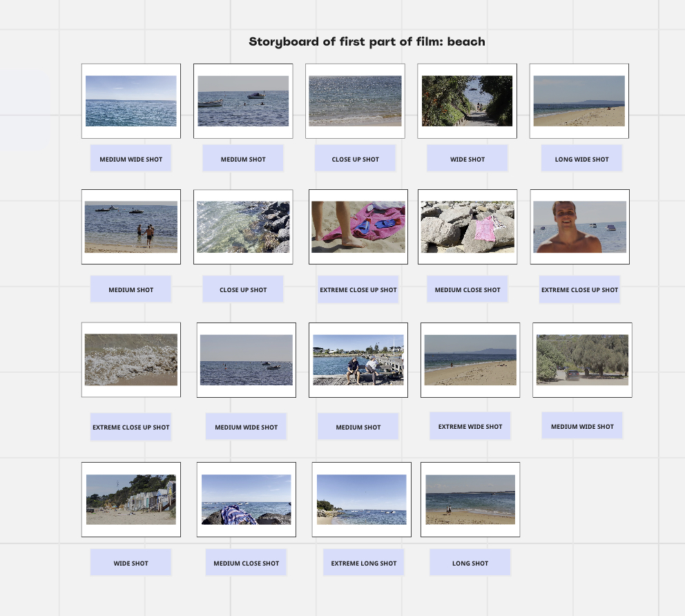
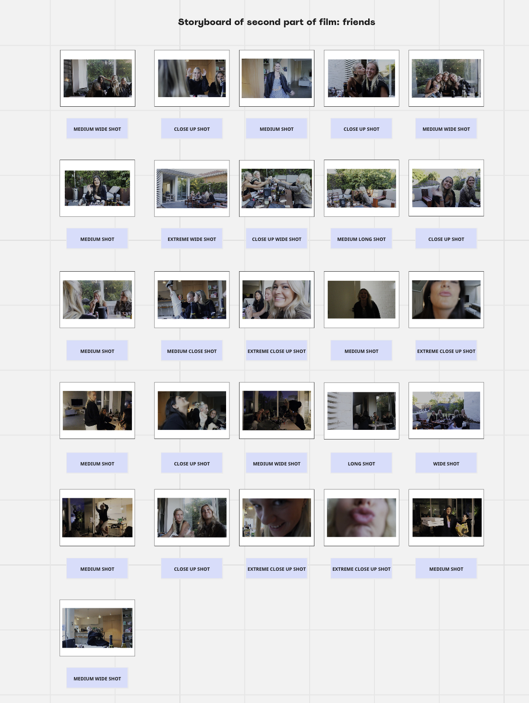

In week 2 session 1, the homework task that was to be completed, was a storyboard for our assessment 1 self portrait. I decided that when making my storyboard, that I wanted to divide it into three sections. The overall theme for my self portrait is love, with the three subcategories being the ocean, girlhood, and family; all things that I love and want to chrerish in my life not only in the present, but into the future as well. The first section of my storyboard is the ocean, with the beach being the introduction into my short film. Down below is screenshot of my first completed storyboard. 

Based off of this storyboard, the main focuses are wide shots and close up shots, with the wide shots representing the elongated calmed water, and the close up shots focusing on certain aspects that appear on the beach, such as snorkelling gear, and people. The music throughout each individual shot is reasonably slow, which creates more of an emphasis on each piece of footage displayed on the screen. The music and videos intertwine into the theme love, as it is a resemblence of how love it supposed to make you feel at peace, with the water speaking metophorically for this theory, as the beach makes me personally feel calm. Graphic and visual continuity is incorporated into this storyboard as the shots are connected through shape, lighting, and colour; the lighting being daylight, and the colour pattern being greens and blues. Whilst temporal discontinuity isn't used, the picture of what my self portrait is trying to paint, is that the video is meant to be percieved as a video where you would gain a sense of nostalgia, and the feeling of "showing your kids what your life once looked like". 

The second part of my storyboard focuses on friendships, and most importantly, girlhood. This conceptual idea is the middle part of my assessment 1 video. The link to the screenshot of the storyboard is below.

This part of the storyboard has a variety of different shots, with a few being medium shots, a couple being extreme close up shots, and some being wide shots. This part of the videos main focus is people, so different angled shots show how relationships of people can be viewed in different ways. The music used for this part of the storyboard was conducted myself, whilst also using a few minor effects to create a more harmonous sound. The idea was stemmed from the recent barbie movie, and how everyone lives their own version of "girlhood". The goal isn't to make the audience sad, but for them to feel emotinally moved, as when seen through a lense, it's sometimes forgotten how much love is circulated around you. This incorporates back to the theme love, as friendships show the bond that people can create, and how love isn't always romantic, but a lot of the time platonic. Spacial continuity is slightly used as each shot is allowing the audience orient themsleves with the shot changes. 

The third part to my storyboard is addressing the subtheme family. This is the last part of my short film. This subcategory was purposefully left as last so the entire theme thats trying to be illustrated is drawn all together. This is shown in the image attached below. 

