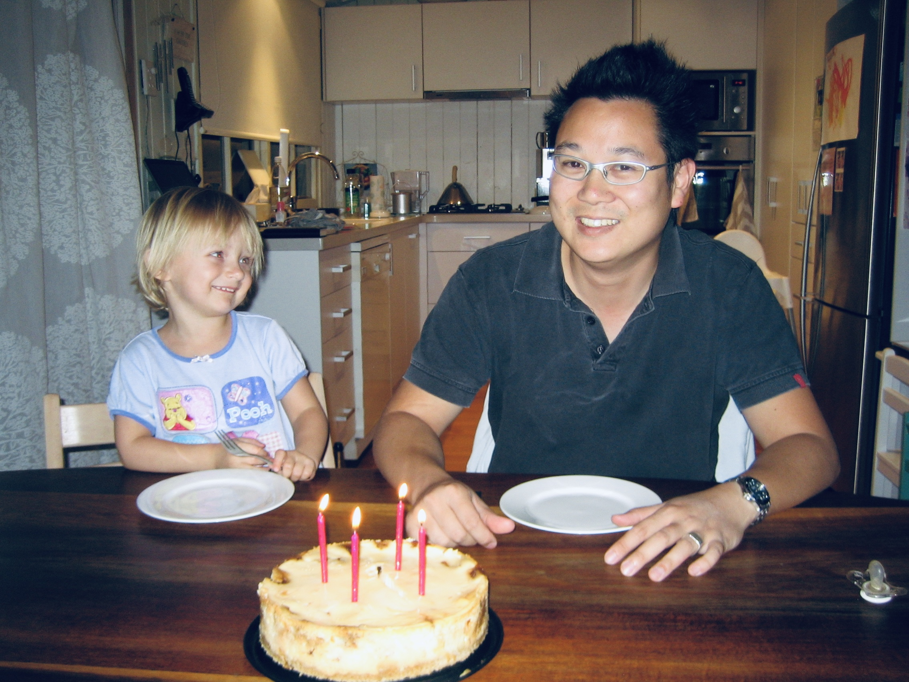

In week 2 session 2, the homework task that was given to the class was to identify a key moment in our planned two minute sequence, the key moment being the part that will most likely make your assessment successful. The key moment that I'm focusing on is in storyobard three, which is the final section of my video and the subcategory family, and it's is a long unclipped video of my siblings and I singing happy birthday to my dad. The music prior to this has a slow build up, with there being a gentle release throughout this part of the video. The music is slow, and only one chord is being played at a time, showing the simplicity in the event thats occuring, but how the little things are so important to appreciate. The reason I believe that this is the key moment in my assessment is because the audiences emotions have already gradually heightened from the other footage prior to this scene, meaning that this piece of the video will be a tipping point as it's the most personal and captivating. The emotional tone of the broader portrait is to embrace the original theme love. This will be supported through editing as each shot isn't rushed. It allows the audience to focus on each shot for an extended period of time, without the idea being lost or dragged on. The audience needs to understand that the reason this shot isn't edited is because the aim is for the audience to feel like they are living in that exact moment themselves. The rhythm, tempo, and pace is extremely slow. This is supported as the music is slowed down, as well as their being very little movement on the screen through this shot too. In addition to this information, whilst the audience won't be able to see this picture, this key moment is the most important to me as it reminds of my favourite photo of me and my dad. My storyboard that was published the previous class is already updated, however link below is the photo of my dad and I, and a screenshot of the specific key moment I am describing.  

